<div align="center">
<picture>
  <source media="(prefers-color-scheme: dark)" srcset=".github/brand/banner-night.svg">
  
</picture>
<br><br>
<a href="#installation"><picture><source media="(prefers-color-scheme: dark)" srcset=".github/brand/tab-installation-night.svg"></picture></a>
<a href="#features"><picture><source media="(prefers-color-scheme: dark)" srcset=".github/brand/tab-features-night.svg"></picture></a>
<a href="#tech-stack"><picture><source media="(prefers-color-scheme: dark)" srcset=".github/brand/tab-tech-stack-night.svg"></picture></a>
<a href="#adding-content"><picture><source media="(prefers-color-scheme: dark)" srcset=".github/brand/tab-adding-content-night.svg"></picture></a>
<a href="#roadmap"><picture><source media="(prefers-color-scheme: dark)" srcset=".github/brand/tab-roadmap-night.svg"></picture></a>
<a href="#license"><picture><source media="(prefers-color-scheme: dark)" srcset=".github/brand/tab-license-night.svg"></picture></a>
</div>

<br>

BitVoyager is a browser-based coding platform that teaches Bash and Python through story-driven missions and a real terminal emulator. Complete levels, earn progress, and practice freely in the sandbox.

<p>
<a name="installation"></a>
<picture><source media="(prefers-color-scheme: dark)" srcset=".github/brand/section-installation-night.svg"></picture>
</p>

```bash
git clone https://github.com/NoamFav/BitVoyager
cd BitVoyager
npm install
npm run dev     # http://localhost:5173
```

```bash
npm run build   # Production build
```

<p>
<a name="features"></a>
<picture><source media="(prefers-color-scheme: dark)" srcset=".github/brand/section-features-night.svg"></picture>
</p>

- Real browser terminal via xterm.js and a custom JS shell
- Story-driven 20-level progression per language
- Adaptive task recommendations based on command history
- Sandbox playground for free exploration
- Supports Bash and Python shells

<p>
<a name="tech-stack"></a>
<picture><source media="(prefers-color-scheme: dark)" srcset=".github/brand/section-tech-stack-night.svg"></picture>
</p>

| Layer | Technology |
|-------|-----------|
| Frontend | React 18, TypeScript |
| Styling | TailwindCSS |
| Terminal | xterm.js, custom jsh |
| State | Context API |
| Routing | React Router |
| Build | Vite |

<p>
<a name="adding-content"></a>
<picture><source media="(prefers-color-scheme: dark)" srcset=".github/brand/section-adding-content-night.svg"></picture>
</p>

**New level** — add to `src/data/bash/levels.ts` and register it in `map.ts`.

**New task** — add to `src/data/bash/tasks.ts` with required commands, expected output, and minimum level.

<p>
<a name="roadmap"></a>
<picture><source media="(prefers-color-scheme: dark)" srcset=".github/brand/section-roadmap-night.svg"></picture>
</p>

- User auth to persist progress
- JavaScript, Rust, and Go language tracks
- Multiplayer coding challenges
- Mobile responsive layout

<p>
<a name="license"></a>
<picture><source media="(prefers-color-scheme: dark)" srcset=".github/brand/section-license-night.svg"></picture>
</p>

Apache 2.0 — see [LICENSE](LICENSE).

<div align="center">
Made with ❤️ by <a href="https://github.com/NoamFav">NoamFav</a>
</div>

<br>

<a href="https://nf-software.com">
<picture>
  <source media="(prefers-color-scheme: dark)" srcset=".github/brand/footer-night.svg">
  
</picture>
</a>
